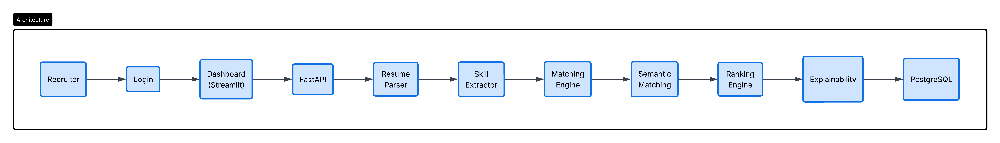

# RecruitVerse

AI Powered Recruitment Intelligence System

RecruitVerse is an AI-driven recruitment platform that automates resume screening, skill extraction, candidate matching, ranking, authentication, and API-based recruitment workflows.

---

## Overview

RecruitVerse helps recruiters process resumes, extract candidate skills, compare resumes with job descriptions, calculate matching scores, rank candidates, and manage recruiter authentication through both Streamlit UI and FastAPI backend.

The project includes:

- Resume Parsing
- Skill Extraction
- Keyword Matching
- Candidate Ranking
- Authentication System
- FastAPI Backend
- Streamlit Dashboard
- PostgreSQL Database
- Docker Deployment
- Unit and Integration Testing
- Logging and Validation

---

## Features

- Resume text extraction from PDF files
- Skill extraction from resume text
- Candidate-job matching score calculation
- Candidate ranking based on score
- Recruiter registration and login
- Password hashing using bcrypt
- Session management using Streamlit
- Protected dashboard access
- REST API using FastAPI
- PostgreSQL database integration
- Dockerized FastAPI and PostgreSQL setup
- Automated testing using pytest
- Logging and error handling

---

## Technology Stack

- Python
- FastAPI
- Streamlit
- PostgreSQL
- Docker
- PyMuPDF
- bcrypt
- pytest
- pandas
- plotly
- sentence-transformers

---

## Project Architecture



---

## Folder Structure

```text
RecruitVerse/
├── data/
├── docs/
│   ├── screenshots/
│   ├── api_documentation.md
│   ├── project_report.md
│   └── user_manual.md
├── exports/
├── logs/
├── sql/
│   └── init.sql
├── src/
│   ├── api/
│   ├── auth/
│   ├── matching/
│   ├── parser/
│   ├── ranking/
│   ├── services/
│   ├── ui/
│   └── utils/
├── tests/
├── Dockerfile
├── docker-compose.yml
├── .dockerignore
├── .env.example
├── requirements.txt
└── README.md